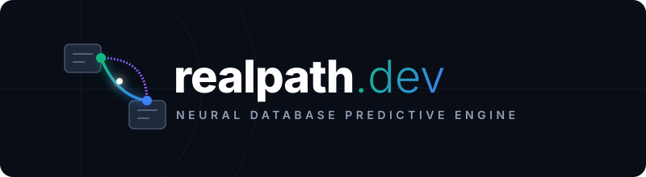
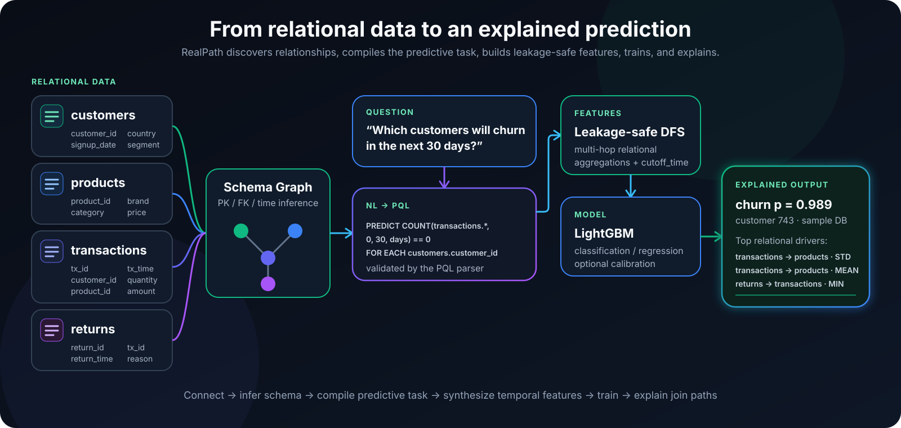
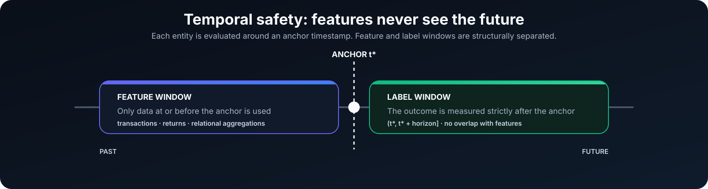
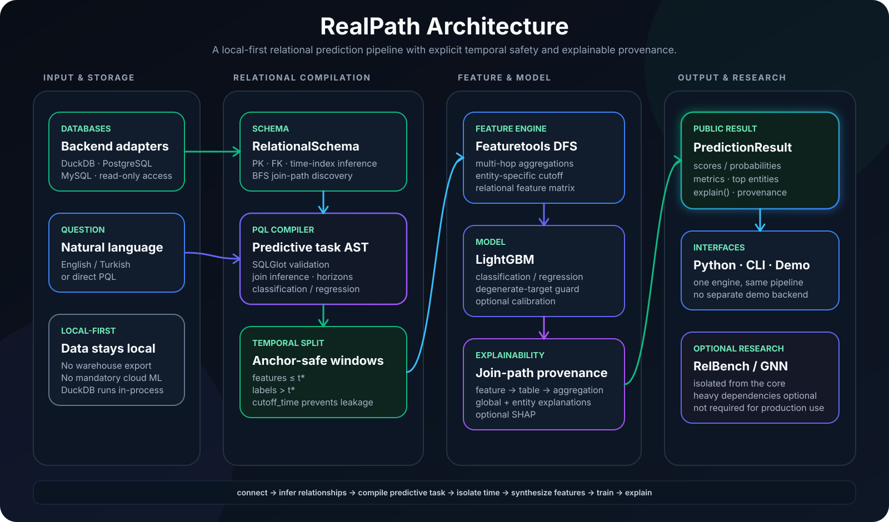

<div align="center">



<br/>

### Open-source, self-hostable relational prediction — directly on your data.

Connect a relational database, ask a predictive question in plain language or PQL, and get an **explained prediction** without exporting the dataset to a separate ML platform.

<br/>


<br/><br/>

<table>
<tr>
<td align="center"><strong>3</strong><br/><sub>VERIFIED BACKENDS</sub></td>
<td align="center"><strong>NL → PQL</strong><br/><sub>PREDICTIVE QUERIES</sub></td>
<td align="center"><strong>LEAKAGE-SAFE</strong><br/><sub>TEMPORAL FEATURES</sub></td>
<td align="center"><strong>EXPLAINED</strong><br/><sub>JOIN-PATH PROVENANCE</sub></td>
</tr>
</table>

<p>
<a href="#why-realpath"><b>Why</b></a> ·
<a href="#how-it-works"><b>How it works</b></a> ·
<a href="#quickstart"><b>Quickstart</b></a> ·
<a href="#pql--predictive-query-language"><b>PQL</b></a> ·
<a href="#verified-results"><b>Results</b></a> ·
<a href="#architecture"><b>Architecture</b></a>
</p>

</div>

---

## Why RealPath

Most business data is not a flat CSV. It lives across related tables: customers, orders, transactions, returns, products and events.

Traditional tabular ML usually requires someone to manually turn those relationships into one training table with repeated SQL joins, aggregations and feature engineering. RealPath automates that relational step.

<table>
<tr>
<td width="50%" valign="top">

### 🔗 Understands relationships

Discovers tables, primary keys, foreign keys and time columns, then builds the relational graph used for multi-hop feature generation.

</td>
<td width="50%" valign="top">

### 🗣️ Predict in plain language

Questions can be translated into **PQL (Predictive Query Language)** and validated before execution. PQL can also be written directly.

</td>
</tr>
<tr>
<td width="50%" valign="top">

### ⏱️ Temporal leakage protection

Feature generation uses entity-specific cutoff times, keeping historical evidence separate from the future label window.

</td>
<td width="50%" valign="top">

### 🔎 Explain relational paths

Predictions expose feature importance and provenance so you can see which table, aggregation and join path contributed to the result.

</td>
</tr>
</table>

---

## How it works

<div align="center">



</div>

The core path is intentionally compact:

```text
database
   ↓
schema + FK graph
   ↓
plain language / PQL
   ↓
predictive task + temporal split
   ↓
Deep Feature Synthesis
   ↓
LightGBM
   ↓
prediction + join-path explanation
```

RealPath is **local-first**: DuckDB runs in-process; PostgreSQL and MySQL are supported through optional connectors. The same predictive pipeline is used across the verified backends.

---

## Quickstart

### Install

```bash
python -m venv .venv

# Windows
.venv\Scripts\activate

# macOS / Linux
source .venv/bin/activate

pip install -e .
```

Optional capabilities:

```bash
pip install -e ".[nlp,explain,demo]"
```

### Run the bundled example

```bash
python data/make_sample_db.py
python examples/quickstart.py
```

### Python API

```python
import realpath as rp

engine = rp.connect("data/shop.duckdb")

result = engine.predict(
    "PREDICT COUNT(transactions.*, 0, 30, days) == 0 "
    "FOR EACH customers.customer_id"
)

print(result.metrics)
result.explain()
result.explain(entity_id=9)
```

### CLI

```bash
realpath make-sample
realpath schema --db data/shop.duckdb
realpath ask "which customers will churn in the next 30 days?" --db data/shop.duckdb
realpath predict "which customers will churn in the next 30 days?" --db data/shop.duckdb --explain
realpath eval
```

---

## PQL — Predictive Query Language

PQL expresses **what should be predicted, for which entity, and over which time window**.

```text
PREDICT AGG(<table>.<column|*>, <start>, <end>, <unit>) [<op> <value>]
FOR EACH <entity_table>.<primary_key>
[WHERE <filter>]
[ASSUMING <filter>]
```

Example:

```text
PREDICT COUNT(transactions.*, 0, 30, days) == 0
FOR EACH customers.customer_id
```

Supported aggregations include `COUNT`, `SUM`, `AVG`, `MIN` and `MAX`. A comparison produces a classification task; an aggregate without a comparison produces regression.

The optional natural-language layer can translate English or Turkish questions into PQL. An offline template fallback is available when the Anthropic extra is not installed.

---

## Temporal safety

<div align="center">



</div>

RealPath builds features from information available **at or before** each entity's anchor timestamp and computes labels strictly afterward. Featuretools `cutoff_time` is used to enforce that separation.

The repository includes a dedicated leakage test:

```bash
pytest tests/test_leakage.py -q
```

---

## Verified results

The figures below are measured on this repository's reproducible sample/evaluation paths. Full methodology lives in [docs/BENCHMARKS.md](docs/BENCHMARKS.md).

| Check | Verified result |
| --- | ---: |
| Test suite | **25 passed**, 2 opt-in connector tests skipped by default |
| DuckDB churn ROC-AUC | **0.7492** |
| PostgreSQL churn ROC-AUC | **0.7492** |
| MySQL churn ROC-AUC | **0.7492** |
| Entity-only baseline ROC-AUC | 0.7043 |
| Relational lift | **+0.045** |
| Calibrated ECE | **0.0144** |
| Calibrated Brier | **0.0392** |

> The benchmark documentation also contains RelBench experiments and the optional GNN research path. The core product does not depend on PyTorch.

---

## Architecture

<div align="center">



</div>

RealPath keeps the production path intentionally small: **database access, relational compilation, leakage-safe feature synthesis, tabular modeling, and provenance-based explanations**. Heavy research paths remain optional instead of becoming mandatory runtime dependencies.

<table>
<tr>
<td width="50%" valign="top">

### 1. Relational layer

`connect.py` provides a common backend interface while `schema.py` discovers **primary keys, foreign keys and time indexes** and builds the graph used for join-path inference.

</td>
<td width="50%" valign="top">

### 2. Predictive compiler

`nlp.py` can translate a natural-language question to PQL. The `pql/` package parses and compiles it into a concrete predictive task with entity, horizon, joins and task type.

</td>
</tr>
<tr>
<td width="50%" valign="top">

### 3. Leakage-safe ML

`features.py` builds relational features with Featuretools DFS and per-entity `cutoff_time`. `model.py` trains the LightGBM classification/regression path and optional calibration.

</td>
<td width="50%" valign="top">

### 4. Explained result

`explain.py` maps generated features back to **tables, aggregations and join paths**. `PredictionResult` exposes scores, metrics and entity-level explanations through the public API.

</td>
</tr>
</table>

### Core module map

| Layer | Module | Responsibility |
| --- | --- | --- |
| **Storage** | `connect.py` | DuckDB, PostgreSQL and MySQL backend interface |
| **Relational graph** | `schema.py` | PK/FK/time inference, EntitySet creation and join paths |
| **Query** | `nlp.py`, `pql/` | natural language → PQL, AST, validation and compilation |
| **Temporal split** | `pql/compile.py` | anchor timestamps, feature/label windows and task construction |
| **Feature engine** | `features.py` | leakage-safe Deep Feature Synthesis |
| **Modeling** | `model.py` | LightGBM classification/regression and calibration |
| **Explainability** | `explain.py`, `result.py` | provenance, global drivers and entity-level explanation |
| **Evaluation** | `eval.py` | local proof path and RelBench adapter |
| **Research** | `gnn.py` | optional experimental relational GNN path |

> **Design rule:** the core stays lightweight and tabular. RelBench, PyTorch and GNN tooling are isolated behind optional evaluation/research dependencies.

For the full contracts, data flow and implementation details, see [docs/ARCHITECTURE.md](docs/ARCHITECTURE.md).

---

## Interactive demo

```bash
pip install -e ".[demo]"
streamlit run realpath/demo_app.py
```

The demo uses the same core engine rather than a separate showcase implementation.

---

## Documentation

| Document | Purpose |
| --- | --- |
| [Architecture](docs/ARCHITECTURE.md) | Deep technical architecture and contracts |
| [Benchmarks](docs/BENCHMARKS.md) | Reproducible measured results |
| [API](docs/API.md) | API reference |
| [Decisions](docs/DECISIONS.md) | Architecture and product decisions |
| [Roadmap](docs/ROADMAP.md) | Planned development |
| [Pitch](docs/PITCH.md) | One-page product summary |
| [Docs Index](docs/INDEX.md) | Documentation map |

---

## License

**MIT.** The core intentionally stays on permissively licensed dependencies.

Optional heavyweight/research integrations are isolated behind extras; see [pyproject.toml](pyproject.toml) and [docs/DECISIONS.md](docs/DECISIONS.md) for the dependency policy.

<br/>

<div align="center">


**Relational prediction without flattening your world first.**

</div>
