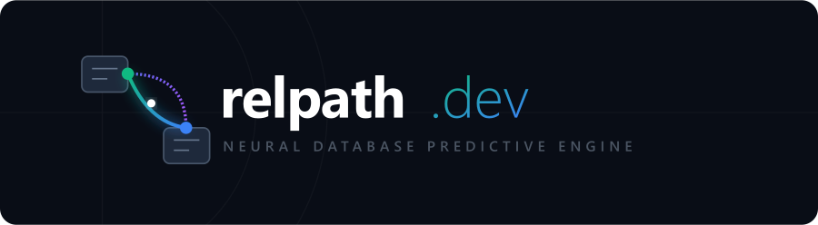

<p align="center">
  
</p>

<h1 align="center">relpath.dev — Neural Database Predictive Engine</h1>

<p align="center">
  <b>The open-source, self-hostable relational prediction engine.</b><br>
  Connect a database, ask a predictive question in plain language, get an <i>explained</i>
  answer — without moving your data anywhere.
</p>

<p align="center">
  <a href="https://github.com/Ozgurisikdamar/relpath/actions/workflows/ci.yml"></a>
</p>

---

## Neden? / Why

Kurumsal verinin çoğu çok-tablolu **ilişkisel** veritabanlarında yaşar, ama klasik ML
araçları yalnızca tek bir düz tabloyu görebilir — aradaki boşluğu aylar süren elle SQL JOIN
ve "öznitelik mühendisliği" kapatır. **relpath** bu süreci otomatikleştirir: şemanızı ve
foreign-key grafiğini çıkarır, sorduğunuz tahmini sızıntısız özniteliklere derler, bir model
eğitir ve **hangi ilişkisel yolun kararı verdiğini** açıklar.

Bu, kategori lideri **Kumo.AI / KumoRFM**'in açık-kaynak, self-host, **local-first** karşıtıdır.
Detaylı strateji & teknik doküman: [`docs/RELPATH_SPEC_v2.md`](docs/RELPATH_SPEC_v2.md).

## Farklılaştırıcılar / Differentiators

- 🔓 **Açık kaynak + self-host + local-first** — DuckDB ile dizüstünüzde çalışır, veri çıkmaz.
- 🗣️ **Doğal dil → PQL** — düz Türkçe/İngilizce sorun; SQLGlot ile doğrulanmış PQL'e çevrilir.
- 🔎 **Açıklanabilirlik** — her tahmin için "hangi tablo / agregasyon / join yolu" etkiledi.
- 📦 **Dikey şablonlar** — `churn`, `forecast`, `fraud` tek satırda.

## Kurulum / Install

```bash
python -m venv .venv && .venv\Scripts\activate      # Windows
pip install -e .
# opsiyonel: pip install -e ".[nlp,explain,demo]"
```

Çekirdek bağımlılıklar izinli lisanslı (MIT/BSD/Apache): `duckdb`, `featuretools`, `lightgbm`,
`sqlglot`, `scikit-learn`. **Not:** `pandas==2.2.x` gerekir (`woodwork` pandas 3.0 ile uyumsuz).

## 60 saniyede / Quickstart

```bash
python data/make_sample_db.py        # bundle synthetic e-commerce DuckDB (zero downloads)
python examples/quickstart.py
```

```python
import relpath as rp

engine = rp.connect("data/shop.duckdb")          # local-first
result = engine.predict(                          # PQL or plain language
    "PREDICT COUNT(transactions.*, 0, 30, days) == 0 FOR EACH customers.customer_id"
)
print(result.metrics)                             # {'roc_auc': 0.749, 'accuracy': 0.737}
result.explain()                                  # global drivers (join paths)
result.explain(entity_id=9)                       # why THIS customer
```

## CLI

```bash
relpath make-sample
relpath schema  --db data/shop.duckdb
relpath ask     "hangi musteriler iade yapacak" --db data/shop.duckdb
relpath predict "gelecek 30 gunde islem yapmayacak musteriler" --db data/shop.duckdb --explain
relpath eval                                       # relational-vs-baseline proof
```

## Interaktif demo (Streamlit)

```bash
streamlit run relpath/demo_app.py
# http://localhost:8501
```

## PQL — Predictive Query Language

```
PREDICT  AGG(<table>.<col|*>, <start>, <end>, <unit>) [<op> <value>]
FOR EACH <entity_table>.<primary_key>
[WHERE <filter>]        -- hangi target satırları etiketi oluşturur
[ASSUMING <filter>]     -- hangi entity'ler skorlanır
```

`AGG ∈ {COUNT, SUM, AVG, MIN, MAX}` · `unit ∈ {days, weeks, months}` ·
karşılaştırıcı varsa **sınıflandırma**, yoksa **regresyon**.

## Zamansal sızıntı güvenliği / Temporal safety

Öznitelikler her entity'nin **anchor timestamp**'inden öncesini, etiket ise sonrasını görür
(Featuretools `cutoff_time`). İki pencere asla kesişmez. Bu yapısal garanti, gelecekteki
veriyi silip özniteliklerin değişmediğini kanıtlayan bir testle güvence altındadır:

```bash
pytest tests/test_leakage.py -q
```

## Değerlendirme / Evaluation

```bash
python -m relpath.eval                              # local: relational vs no-feature baseline
python -m relpath.eval --dataset rel-hm --task user-churn   # RelBench (needs: pip install -e ".[eval]")
```

`relbench` yolu torch çeker ve çekirdekten izoledir; `rel-f1` ile doğrulandı (driver-dnf,
driver-position) — başka datasetlerde kendiniz tekrar üretebilirsiniz.

## Mimari / Architecture

```
connect → schema (FK grafiği) → PQL compile (join inference + zaman penceresi)
        → features (DFS + cutoff) → model (LightGBM/TabPFN) → explain (join-yolu provenance)
```

| Modül | Rol |
|---|---|
| `connect.py` / `schema.py` | DuckDB bağlantısı + otomatik PK/FK/zaman tespiti, Featuretools EntitySet |
| `pql/` | PQL parser (SQLGlot) + join-path inference + zaman penceresi izolasyonu |
| `features.py` | Deep Feature Synthesis (sızıntı-güvenli) |
| `model.py` | LightGBM (auto clf/reg), opsiyonel TabPFN |
| `explain.py` | join-yolu provenance + SHAP |
| `nlp.py` | NL→PQL (Claude + offline şablon fallback) |
| `eval.py` | yerel + RelBench değerlendirme |

## Lisans / License

MIT. `data/`, `docs/` dahil çekirdek izinli lisanslıdır. getML (ELv2) ve TabPFN-2.5
(ticari kullanım yasak) **çekirdeğe alınmaz** — yalnızca opsiyonel eklenti.
